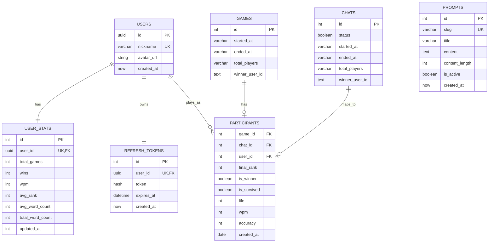

# Keyboard Warrior Battle Royale ERD

## ERD Principle


## Source Schema

```text
Table users {
  id uuid [primary key]
  nickname varchar [unique]
  avatar_url string
  created_at now
}

Table user_stats {
  id integer [pk]
  user_id uuid [unique, ref: - users.id]
  total_games integer
  wins integer
  wpm integer
  avg_rank integer
  avg_word_count integer
  total_word_count integer
  updated_at integer
}

Table refresh_tokens  {
  id integer [primary key]
  user_id uuid [unique, ref: - users.id]
  token hash
  expires_at datetime
  created_at now
}

Table prompts {
  id integer [primary key]
  slug varchar [unique]
  title varchar
  content text
  content_length integer
  is_active boolean
  created_at now
}

Table games {
  id integer [primary key]
  started_at varchar
  ended_at varchar
  total_players varchar
  winner_user_id text
}

Table participants {
  game_id integer [ref: > games.id]
  chat_id integer [ref: > chats.id]
  user_id integer [ref: > users.id]
  final_rank integer
  is_winner boolean
  is_survived boolean
  life integer
  wpm integer
  accuracy integer
  created_at date
}

Table chats {
  id integer [primary key]
  status boolean
  started_at varchar
  ended_at varchar
  total_players varchar
  winner_user_id text
}
```

## Mermaid ERD



## Interpretation Notes

- `users`: 익명 사용자 기본 프로필
- `user_stats`: 대시보드 집계 데이터
- `refresh_tokens`: 재로그인 및 세션 연장용 토큰 저장
- `prompts`: 타이핑 게임에서 사용할 한글 원문 저장
- `games`: 각 배틀 라운드 메타데이터
- `participants`: 사용자별 게임 결과 기록
- `chats`: 현재 스키마상 참가 기록과 연결된 별도 세션 또는 룸 개념으로 해석 가능

## Implementation Notes

- `games`는 현재 운영 DB의 종료 결과 저장 컬럼만 문서화합니다.
- `started_at`, `ended_at`, `total_players`, `winner_user_id` 타입은 실제 DB와 서비스 payload 기준을 따릅니다.
- `participants.is_survived`는 참가자가 종료 시점까지 생존했는지 저장합니다.
- 멀티 탭 감지, 비활성 사용자 실격, 실시간 진행률 갱신 같은 기능은 우선 DB 스키마 변경 없이 소켓 연결 상태와 Redis 메모리 상태로 처리하는 방향을 권장합니다.
